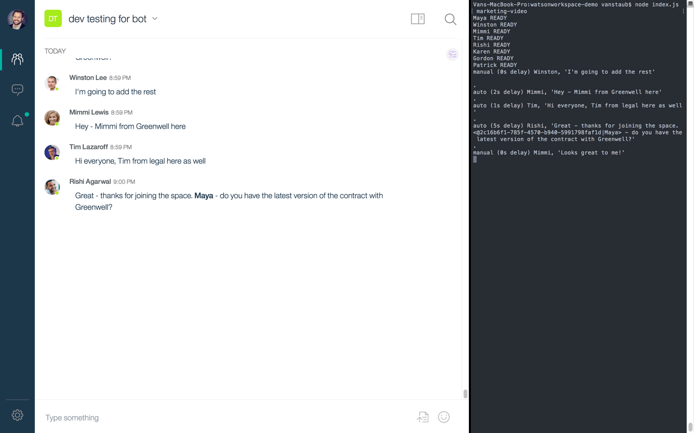

# IBM Watson Workspace Demo Assistant

During a live demo or screen recording, multiple actors are needed to send
messages or files into spaces to simulate real activity. To make the process more
scripted, the demo assistant app uses "bots" to portray real persons.

Bots (and apps) have specific limitations in Workspace. For example, a message posted by
a bot will have a small vertical line to the left of the message text.  The bot's profile
photo will be rounded squares rather than circular like users. Both ensure that a bot does not appear
to be a real person.

To work with this design while also creating something that is programmed and repeatable,
the demo assistance app has the following approach.
- An bot should be registered in Watson Work Services for each "person".
The application's name should be the corresponding person, "Maya Davis" for example.
- A photo with circular vignette and green presence indicator should be created.
- For demos and recordings, a [browser script](userscript.js) is used to remove the vertical app indicator.
- A repeatable script is created with messages or file uploads corresponding to the "person".



## Installation

Use the `npm install` terminal command inside the application directory.

## Places, people!

A script is defined as `script.json` in a directory of your choice. Think of it just like a script used in acting. The script follows the format below.

```javascript
{
  "actors": {
    "Maya": "88235eba-840a-3764-b23d-d12aa5d46740:Nl0Y324VywAIYo832GsEOOH-__SIWQi5",
    "Winston": "bsdf339c2-0232-44fd-9651-a0sda56fe00d:gNjTFhsdf32dsDS64XCEdg1Ao1h",
  },
  "spaces": {
    "deal": "5a2ec216232sa0fa0d6ff65d21",
    "sales": "5a2ec2316234420fa2e3263d21"
  },
  "lines": [
    {
      "actor": "Winston",
      "space": "deal",
      "text": "I'm going to add the team to this space"
    },
    {
      "actor": "Maya",
      "space": "deal",
      "text": "Hey - Maya from Greenwell here",
      "auto": true,
      "delay": 5000
    },
    {
      "actor": "Winston",
      "space": "deal",
      "text": "Great - thanks for joining the space. *Maya* - do you have the latest version of the contract with Greenwell?",
      "auto": true,
      "delay": 5000
    },
    {
      "actor": "Winston",
      "space": "sales",
      "filename": "2018 Trends.PDF"
    },
    {
      "actor": "Winston",
      "space": "sales",
      "text": "Who has the bandwidth to update the pitch deck with this info?"
    }
  ]
}
```

The `actors` property declares aliases such as *Maya* and the app's `client:secret` used to log in to Workspace.

The `spaces` property similarly declares aliases for spaces such as *sales* with the corresponding spaceId.

The `lines` array declares the messages that will be sent sequentially into a space by a given actor. If the `actor` property is omitted, the message is sent as the demo assistant app.

## Setup

1. Create an app on the [Your Apps](https://developer.watsonwork.ibm.com/apps) page. An app should be created for each "person".
2. Add the app's clientId and secret to the corresponding entry in the script. The format is `clientId:secret` seen
in the following example.
```
"actors": {
  "Maya": "88235eba-840a-3764-b23d-d12aa5d46740:Nl0Y324VywAIYo832GsEOOH-__SIWQi5"
}
```
3. Add a photo in the `/photos` directory. The photo should have the same name as the property in the `actors` object.
In the above example, we would create a file called `Maya.jpg`. (Ensure that the case is the same.)

## Sending Messages
There are two ways to send messages:
- Manually
- Automatically

Lines that omit the `auto` property or are set to `auto: false` will be manually sent into a space. To trigger the line to be sent, the user hits the `enter` key on the terminal. Doing so sends the message and queues the next line.

Automatic lines `auto: true` will be sent automatically by the application. This is useful when you have a group of interactions that will occur without your intervention. To make the dialog appear natural, you can specify a `delay`.  For example, `delay: 5000` would specify a 5 second delay from completion of the previous message. If `delay` is omitted, an average reading level of 200 words per minute will be used.

Messages come in two categories:
- Text
- Files

If the `text` property is used, a text message will be sent. You can use Markdown as part of the message text.

If the `filename` property is set to a filename, the file will be uploaded into the space.

## Starting the App
From the terminal run `node index.js <directory>`. The directory should be located in the `scripts` directory of the demo assistant app.

For example
`node index.js marketing-video`

All assets such as the `script.json` and files should reside in the directory. The `script.json` will be automatically processed when the application starts.

Additionally, any actors will be authenticated and their photos uploaded.

After all actors are authenticated, you can use the `enter` key on the terminal to send manual messages or wait for automatic messages to queue.

## Stopping or Restarting

After any updates to `script.json`, use `ctrl+c` to stop the app and restart it with the `node index.js <directory>` command.

## Known Limitations

Because these are applications and not real people there are a few limitations.
- @mentions do not work fully. They will not trigger the notification to the user. To give the appearance of an @mention, you can use boldface for the text.
- Bot messages do not show in moments.
- Bot messages will not trigger a MessageFocus, which is the underlined text used to initiate ActionFulfillment.

To get around these issues, you should use a real user with the same name as the bot. This allows you to send actual messages to overcome these issues. Once your real messages are sent, you can resume the demo app with the `enter` key to process the next line.

## Browser Script

If demoing Workspace from the browser, you can use the [userscript.js](userscript.js)
to remove the vertical indicator. Use either [Tampermonkey](https://chrome.google.com/webstore/detail/tampermonkey) or [Greasemonkey](https://addons.mozilla.org/en-US/firefox/addon/greasemonkey/) and copy the `userscript.js`
script located in this project.
