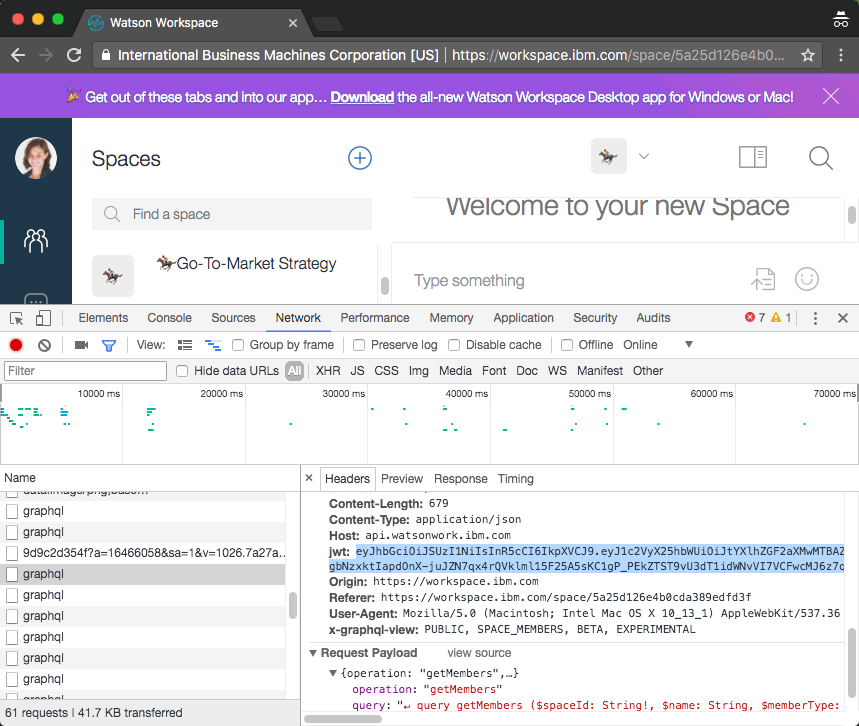

# IBM Watson Workspace Demo Assistant

During a live demo or screen recording, multiple actors are needed to send
messages or files into spaces to simulate real activity. To make the process more
scripted the demo assistant app impersonates users and sends scheduled or manual messages.

## Installation

Use the `npm install` terminal command inside the application directory.

## Script

A script is defined as `script.json` in a directory of your choice. Think of it just like a script used in acting. The script follows the following format.

```javascript
{
  "actors": {
    "Maya":
      "eyJhb...RtlUjg",
    "Winston":
      "eyJhb...fSAZZ9bNeBzg",
  },
  "spaces": {
    "deal": "5a2ec21624c0fa0d6ff65d21",
    "sales": "5a2ec216e420fa2e63f65d21"
  },
  "lines": [
    {
      "actor": "Winston",
      "space": "deal",
      "text": "I'm going to add the team to this space"
    },
    {
      "actor": "Maya",
      "space": "deal",
      "text": "Hey - Maya from Greenwell here",
      "auto": true,
      "delay": 5000
    },
    {
      "actor": "Winston",
      "space": "deal",
      "text": "Great - thanks for joining the space. @Maya - do you have the latest version of the contract with Greenwell?",
      "auto": true,
      "delay": 5000
    },
    {
      "actor": "Winston",
      "space": "sales",
      "filename": "2018 Trends.PDF"
    },
    {
      "actor": "Winston",
      "space": "sales",
      "text": "Who has the bandwidth to update the pitch deck with this info?"
    }
  ]
}
```

The `actors` property declares aliases such as *Maya* and the JWT token used to log in to Workspace.

The `spaces` property similarly declares aliases for spaces such as *sales* with the corresponding spaceId.

The `lines` array declares the messages that will be sent sequentially into a space by a given actor.

## Sending Messages
There are two ways to send messages:
- Manually
- Automatically

Lines that omit the `auto` property or are set to `auto: false` will be manually sent into a space. To trigger the line to be sent, the user hits the enter key on the terminal. Doing so sends the message and queues the next line.

Automatic lines `auto: true` will be sent automatically by the application. This is useful when you have a group of interactions that will occur without your intervention. To make the dialog appear natural, you can specify a `delay`.  For example, `delay: 5000` would specify a 5 second delay from completion of the previous message. If `delay` is omitted, an average reading level of 200 words per minute will be used.

Messages come in two categories:
- Text
- Files

If the `text` property is used, a text message will be sent. You can use Markdown as part of the message text.

If the `filename` property is set to a filename, the file will be uploaded into the space.

## Starting the App
From the terminal run `node index.js <director>`.

For example
`node index.js /Users/vanstaub/git-public/watsonw
orkspace-prez/scripts/marketing-video`

All assets such as the `script.json` and files should reside in the directory. The `script.json` will be automatically processed when the application starts.

Additionally, any actors will be authenticated. You should update the actor's JWT tokens if any FAILED messages are reported.

After all actors are authenticate, you can use the `enter` key on the terminal to send manual messages or wait to automatic messages to queue.

### Getting the JWT Token
This is the most technical part of the application since the app does not "log in" the actor.

To get the JWT token, you should launch a private or incognito browser window and log the user in to Workspace. You will then need to copy the JWT token seen as part of the request headers - usually a graphql request.



After copying the JWT token, paste the token into the corresponding actor property in the `script.json` file.

```javascript
{
  "actors": {
    "Maya": "eyJhb...RtlUjg",
    ...
```

The token will appear much much longer than this example.
